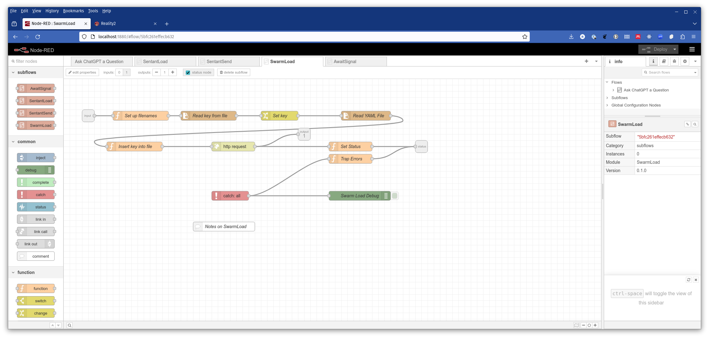

# A Node-RED example

Node-RED is a graphical interface for low-code programming for event-driven applications.  You can read all about it [here](https://nodered.org/).

In the node-red folder, there is a JSON file that creates a Node-RED flow and subflows for setting up and using the ChatGPT plugin.

You will need to have Node-RED installed and running, and then you can load the main flow using the Import menu option.

### Prerequisites

Aside from the standard nodes, you'll need to install dashboard2 - @flowfuse/node-red-dashboard.  You do this through the main menu (right hand side bars) using the 'Manage palette' menu option.

Everything else is done using the inbuilt Node-RED nodes for http requests and websockets.

### Setting the home directory

You will also need to change the home directory for the sentantLoad subflow.  Double click on the GraphQL-SentantLoad node in the main flow to open up the parameters view.

When done, close the parameters view, and click on the Deploy button to save the changes.

### The main flow

### The Dashboard

### The subflows

#### SentantLoad

#### SentantSend

#### SwarmLoad

#### AwaitSignal

